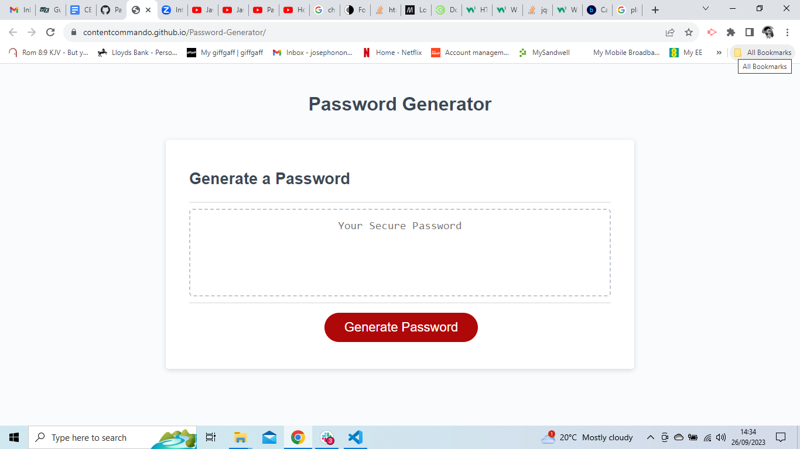

# Password-Generator
This is an application for generating random passwords. It features prompts, 
alerts and confirmations to seek user's criteria for the password to be generated.
Once criteria are set, password is generated.

## Work Done So Far...

**Criteria Set-Up:** The application is able to collect and store input from the user 
to determine whatever parameters they want on their desired output.

  *Example:*
1. User can select a password length of at least 8 characters but no more than 128.
2. User can select character types to be included, within the range of
    - Lowercase letters
    - Uppercase letters
    - Numeric characters
    
**Input Validation:** The written code is able to validate each input made by 
the user as part of the logic built into it using "If else" conditional statements. 
Invalid inputs are detected, while true or false confirmations are routed in the 
relevant direction, so that users can make their choice of password criteria.

## Yet-To-Be-Done:
The last phase of the project will be to develop the code so it can convert these user 
inputs to actual random passwords, based on the the custom-criteria of the user.

This a [link](https://contentcommando.github.io/Password-Generator/) to the application.

**Screenshot**

